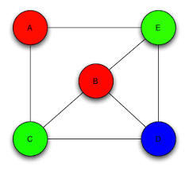

# Bule Tutorial

## What is Bule?

Bule is a tool used to create CNF (conjunctive normal form) encodings for SAT solving.

- SAT (Boolean Satisfiability) is the problem of determining if there exists an assignment of `True` or `False` to the variables of a boolean formula such that the formula evaluates to `True`.
- A formula consists of
  - **Variables**: Variables that can either be `True` or `False`
  - **Parentheses**: Things in parentheses are evaluated first
  - **Conjunction**: AND operator (`&`)
  - **Disjunction**: OR operator (`|`)
  - **Negation**: NOT operator (`!`)
- A formula is in CNF if:
  - It is a conjunction of clause(s), where a clause is a disjunction of literals
  - English form: Everything inside the brackets are "OR"ed together, and all the brackets are "AND"ed together
  - Example: `(x1 OR NOT x2) AND (NOT x1 OR x2 OR x3) AND NOT x1` from [Wikipedia](https://en.wikipedia.org/wiki/Boolean_satisfiability_problem#:~:text=clause.%20The%20formula-,(x1%20%E2%88%A8%20%C2%ACx2)%20%E2%88%A7%20(%C2%ACx1%20%E2%88%A8%20x2%20%E2%88%A8%20x3)%20%E2%88%A7%20%C2%ACx1,-is%20in%20conjunctive)

Bule helps you "encode" or "represent" these boolean formulas cleanly (the full list of its abilities is listed on the GitHub README).
You can then use a SAT solver to solve these formulas (find an assignment of `True` or `False` to the variables s.t. the formula evaluates to `True`).


## Formula Representation

Representation of `(x1 OR NOT x2) AND (NOT x1 OR x2 OR x3) AND NOT x1` in Bule:

```
 x1 | ~x2.
~x1 |  x2 | x3.
~x1.
```
[Bule File](basic.bul)

**Note:**
- Each clause is on a different line, OR is done through `|` and NOT is done through `~`.
- A line ends with a `.` (similar to semicolon in most programming languages).
- Formula (AKA search) variables have to be declared with `#exists`
- Lines that begin with `%` are comments

> How many different assignments of Trues and Falses will evaluate to True for this formula (solve manually)?

To solve an formula:
```
bule --solve basic.bul
```

To show all models (all assignments that can be True):
```
bule --solve --models 0 basic.bul
```

To show the first `x` satisfying models
```
bule --solve --models x basic.bul
```

## Encoding Problems

If we can represent a problem in CNF form, then we can use SAT solvers to solve for it.

Graph Colouring is a problem where given a graph, find an assignment of colours to each vertex such that adjacent vertices (vertices that are one edge apart) are not the same colour.

Example:



> To represent this in CNF, what would the variables represent?

We want to find an assignment of colours.
Because we are only working with boolean variables, we can only represent if something is something, or is not something.
As a result, we need a variable for each colour-vertex pair).

> To represent this in CNF, what would the clauses be?

We have to determine the rules:

1. Every vertex has to be given a colour.
   - This is enforced through two rules:
     1. Each vertex has to be at least one colour
     2. Each vertex is max one colour
2. Adjacent vertices cannot be the same colour.

> How can we code this up?

[Bule file containing the rules for A and E](graph_colouring_basic.bul).

Running `bule --solve --models 0 graph_colouring_basic.bul` should show all valid colour assignments.

Output:
```
Instance ground. Starts solving
SAT
Model 1: ~set_a_blue ~set_a_green  set_a_red ~set_e_blue  set_e_green ~set_e_red
Model 2: ~set_a_blue ~set_a_green  set_a_red  set_e_blue ~set_e_green ~set_e_red
Model 3: ~set_a_blue  set_a_green ~set_a_red ~set_e_blue ~set_e_green  set_e_red
Model 4: ~set_a_blue  set_a_green ~set_a_red  set_e_blue ~set_e_green ~set_e_red
Model 5:  set_a_blue ~set_a_green ~set_a_red ~set_e_blue  set_e_green ~set_e_red
Model 6:  set_a_blue ~set_a_green ~set_a_red ~set_e_blue ~set_e_green  set_e_red
No more models. Total: 6 displayed models out of 6 models.
```

If a variable has a `~` in front of it, it means it is assigned `False`.
Since we only care about what vertex is what colour, adding / uncommenting the lines

```
#hide ~set_a_blue, ~set_a_green, ~set_a_red.
#hide ~set_e_blue, ~set_e_green, ~set_e_red.
```

will hide those variables from the output if they are false (and if there is no `~` in front of each variable, we will hide the variables from the output if they are assigned `True`).

The new output looks like this:
```
Instance ground. Starts solving
SAT
Model 1:  set_a_red  set_e_green
Model 2:  set_a_red  set_e_blue
Model 3:  set_a_green  set_e_red
Model 4:  set_a_green  set_e_blue
Model 5:  set_a_blue  set_e_green
Model 6:  set_a_blue  set_e_red
No more models. Total: 6 displayed models out of 6 models.
```

## Grounding

This process gets quite intensive if we were to add more colours, vertices, and edges.
Currently there is a lot of copy and pasting, but using bule we can perform grounding, which is a process of taking a higher level language or representation and then converting it to basic CNF.

1. Rename all instances of `set_<vertex>_<colour>` with `set(<vertex>,<colour>)` in the file, i.e. from `set_a_blue` to `set(a,blue)` (this does not change the behaviour, and only changes the variable name).
2. Note that here, we are looping through all the colours in the clauses, if we were to add a new colour, we would have to do `~set_a_new | ~set_e_new`
    ```
    ~set(a,blue)  | ~set(e,blue).
    ~set(a,green) | ~set(e,green).
    ~set(a,red)   | ~set(e,red).
    ```
   We can declare grounding variables (variables that will not be used in final formula, but will help us "express" the formulas better) at the top of the file.
   ```
   #ground colour[blue].
   #ground colour[green].
   #ground colour[red].
   ```
   Here we are saying *we define the set `colour` which contains `blue`, `green`, and `red`*.
   Note that we use square brackets `[]` instead of parenthesis `()`.

   Then we can rewrite the original lines to:
   ```
   colour[C] :: ~set(a,C) | ~set(e,C).
   ```
   which reads as *for all C in colour, we have the clause: ~set(a,C) | ~set(e,C)*.
   We can verify this is the same as our original clauses by running
   `bule graph_colouring_basic.bul`, 
   which prints out the grounded output (the result of taking our higher level description into the clauses).
3. We can also rewrite the following lines
   ```
   ~set_a_blue  | ~set_a_green.
   ~set_a_blue  | ~set_a_red.
   ~set_a_green | ~set_a_red.

   ~set_e_blue  | ~set_e_green.
   ~set_e_blue  | ~set_e_red.
   ~set_e_green | ~set_e_red.
   ```
   by declaring the set of vertexes (note we can also ground variables in one one line)
   ```
   #ground vertex[a], vertex[e].
   ```
   
   Now the above clauses can be rewritten as 
   ```
   vertex[V], colour[C1], colour[C2], C1 != C2 :: ~set(V,C1) | ~set(V,C2).
   ```
   Running `bule graph_colouring_basic.bul` however produces the set of clauses 
   ```
   #exists[0] set(e,red).
   #exists[0] set(e,green).
   #exists[0] set(e,blue).
   #exists[0] set(a,red).
   #exists[0] set(a,green).
   #exists[0] set(a,blue).
   set(a,blue) | set(a,green) | set(a,red).
   set(e,blue) | set(e,green) | set(e,red).
   ~set(a,blue) | ~set(a,green).
   ~set(a,blue) | ~set(a,red).
   ~set(a,green) | ~set(a,blue).
   ~set(a,green) | ~set(a,red).
   ~set(a,red) | ~set(a,blue).
   ~set(a,red) | ~set(a,green).
   ~set(e,blue) | ~set(e,green).
   ~set(e,blue) | ~set(e,red).
   ~set(e,green) | ~set(e,blue).
   ~set(e,green) | ~set(e,red).
   ~set(e,red) | ~set(e,blue).
   ~set(e,red) | ~set(e,green).
   ~set(a,blue) | ~set(e,blue).
   ~set(a,green) | ~set(e,green).
   ~set(a,red) | ~set(e,red).
   ```
   At the moment it is hard to discern where our clauses are.
   If we add something like `| debug.` or `| <line_number>.` at the end of the line, i.e.
   ```
   vertex[V], colour[C1], colour[C2], C1 != C2 :: ~set(V,C1) | ~set(V,C2) | debug.
   ```
   we get the following output after running the grounding
   ```
   Warning. Undeclared variables: debug

   #exists[0] set(e,red).
   #exists[0] set(e,green).
   #exists[0] set(e,blue).
   #exists[0] set(a,red).
   #exists[0] set(a,green).
   #exists[0] set(a,blue).
   set(a,blue) | set(a,green) | set(a,red).
   set(e,blue) | set(e,green) | set(e,red).
   ~set(a,blue) | ~set(a,green) | debug.
   ~set(a,blue) | ~set(a,red) | debug.
   ~set(a,green) | ~set(a,blue) | debug.
   ~set(a,green) | ~set(a,red) | debug.
   ~set(a,red) | ~set(a,blue) | debug.
   ~set(a,red) | ~set(a,green) | debug.
   ~set(e,blue) | ~set(e,green) | debug.
   ~set(e,blue) | ~set(e,red) | debug.
   ~set(e,green) | ~set(e,blue) | debug.
   ~set(e,green) | ~set(e,red) | debug.
   ~set(e,red) | ~set(e,blue) | debug.
   ~set(e,red) | ~set(e,green) | debug.
   ~set(a,blue) | ~set(e,blue).
   ~set(a,green) | ~set(e,green).
   ~set(a,red) | ~set(e,red).
   ```
   which introduces a new variable, but can make it easier to determine what clauses are being generated.
   A useful tip is to pipe the output through `grep`, i.e. `bule graph_colouring_basic.bul | grep debug` to see only the clauses that have `debug` in it.

   Here we can see that there are unnecessary clauses being generated, i.e. below, the 2nd clause below is the same as the 1st
   ```
   ~set(a,blue) | ~set(a,green).
   ~set(a,green) | ~set(a,blue).
   ```
   If we want to avoid these repeated clauses, we can replace `C1 != C2` with `C1 < C2`
   ```
   vertex[V], colour[C1], colour[C2], C1 < C2 :: ~set(V,C1) | ~set(V,C2).
   ```
   and this will now remove the duplicated clauses.
4. Finally we can also replace the following clauses
   ```
   set_a_blue | set_a_green | set_a_red.
   set_e_blue | set_e_green | set_e_red.
   ```
   However, note that this is a disjunction between the colours.
   As a result we have to do
   ```
   vertex[V] :: colour[C] : set(V,C).
   ```
   Which reads as *for all `V` in vertices, we have a clause that is the conjunction of `set(V,C)` for all colours `C`*.
5. We can further clean up our code by having a set of edges, i.e.
   ```
   #ground edge[a,e].
   ```
   and then replacing the last line with
   ```
   edge[V1,V2], colour[C] :: ~set(V1,C) | ~set(V2,C).
   ```
   so that we can introduce new edges easily.
6. Finally, it helps to split up our "models" and "rules".
   We have a lot of `#ground x[y]` variables at the top, which encodes a graph of edges, and vertices, along with colours.
   We also have the clauses below which encode the graph colouring problem.

   It helps the split the file into 2, i.e. [graph_colouring_grounded.bul](graph_colouring_grounded.bul) (which represents the graph colouring problem) and [graph1.bul](graph1.bul) (which represents the graph in the image above).
   Then we can run the command
   ```
   bule --solve --models 0 graph_colouring_grounded.bul graph1.bul
   ```
   to find all the valid instances of colour assignments for graph1.

   The benefit of this is that we can now make different graph models in their own files and then solve them by adding the file as a command line argument in bule.

   [graph2.bul](graph2.bul) introduces a new edge between a and b, and the number of models compared to [graph1](graph1.bul) goes down from 12 to 6.
   [graph3.bul](graph3.bul) is extended off [graph2.bul](graph2.bul) and introduces a new edge between a and d.
   Solving for graph3 produces the output
   ```
   Instance ground. Starts solving
   UNSAT
   No more models. Total: 0 displayed models out of 0 models.
   ```
   meaning that there is no possible assignment of colours to vertices such that adjacent vertices are different colours.
